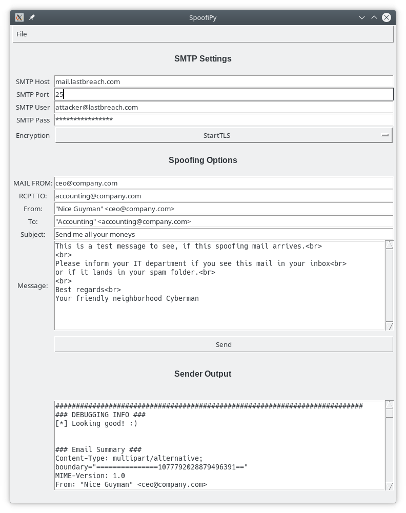

# SpoofiPy
SpoofiPy - A little helper for easier mail spoofing

## FLuff
```
# Description: This is a small program I wrote in order to make email spoofing and hence testing of SPF, DMARC and DKIM records a bit easier.
# Motivation: I was annoyed, that my SMTP server quit on me everytime I accidentally forgot one step in our communication. 
# Benefit: Send slightly altered spoofing mails without going through all of the SMTP chain again and again :)
# Questions: Frederic Mohr [at] LastBreach com
```
## Tech Stuff 
```
# Dependencies: python3, python3-tk
# Requirements: Knowhow and your own mail server
# Version: v1.190314
```
## Usage

I expect you to know how mail spoofing works. This is a tool to help testers, not a skiddie hand holding device. :)

Here's an example that should help. If not, have a look at the source.  Adjust the code to your requeriments. 




